# 阿兹海默症患者守护 App — 界面走查（Walkthrough）

> POC 演示索引 · 截图为当前实现的真实渲染。规格见 [`../SPEC.md`](../SPEC.md)。
> 数据全为占位假数据，经 service 层抽象，可无痛替换真实 API。

## 快速开始

```bash
npm install
npm run dev        # http://localhost:5173/
```

- 顶部 **角色切换**：`照护者 ⇄ 患者`。
- 顶部 **演示态开关**：`正常 / 空数据 / 错误 / 加载中`，实时驱动当前页四态。
- **照护者端 = 竖屏手机**；**患者端 = 横屏智能屏/电视大屏**。

---

## 一、照护者控制台（竖屏手机 · 底部 5 tab）

底部导航：首页 / 提醒 / 告警 / 陪伴 / 设置。

### 首页 Dashboard `/caregiver`
一眼看到患者"现在好不好"：本周情绪周历 + 今日提醒。布局/配色照参考图还原。

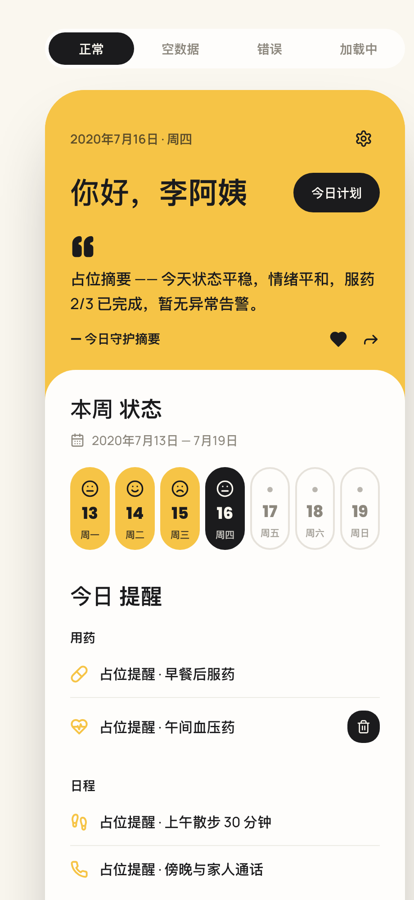

四态（顶部演示开关切换）：

| 空数据 | 错误 | 加载中 |
|---|---|---|
| 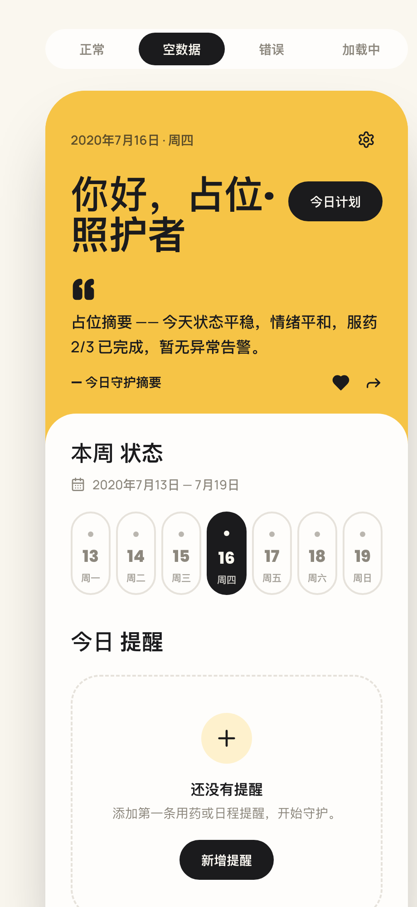 | 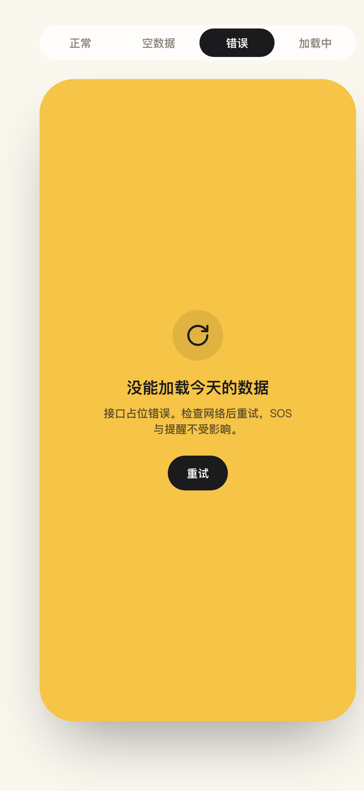 | 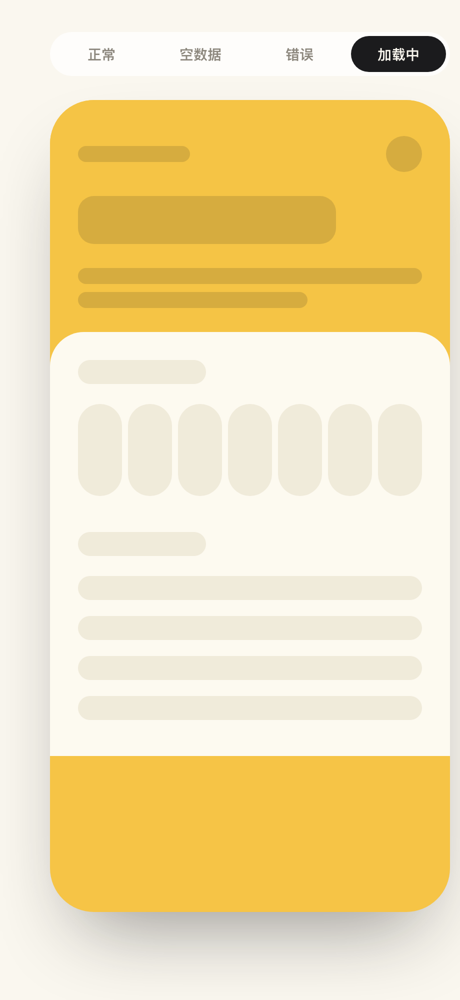 |

### 提醒管理 `/caregiver/reminders`
上午/下午/晚上分组；已完成 ✓ / 已错过（红）/ 待办；声线播报标记。
**新增/编辑/删除全功能**：右上「＋」新增、点某行进入编辑；表单含类型（用药/血压/喝水/活动/通话）、时间、内容、播报声线；写回实时监护状态机并按时间排序，编辑态可删除（二次确认）。

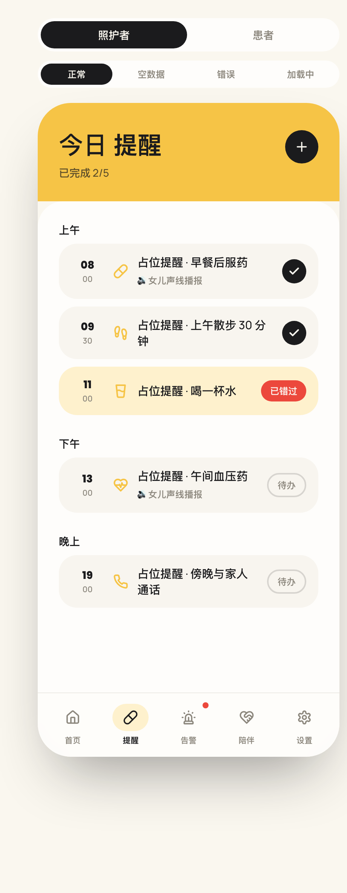
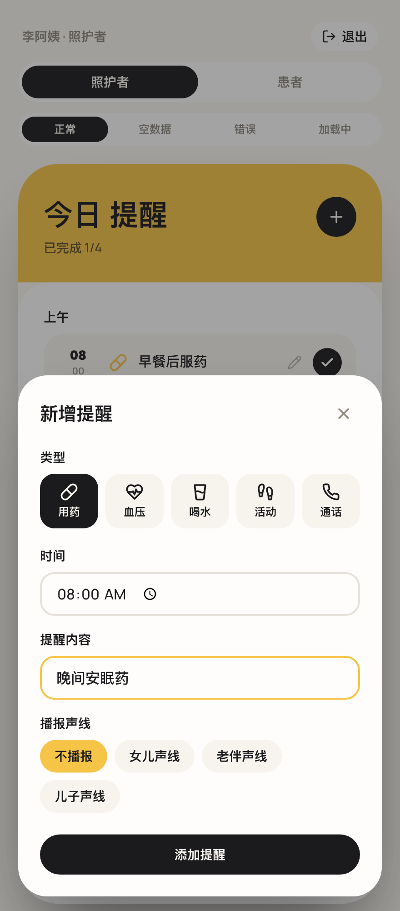

### 告警 / SOS 中心 `/caregiver/alerts`
**SOS 全链路时间线签名卡**（触发→发送→接收→等待响应）+ mock 最后位置。
**真实异常状态机**（`MonitorProvider`，非预置）：在线/失联横幅 + 今日服药 X/Y；「演示 · 异常路径」控制可触发「服药计时」（约 8s 到点未确认 → 自动升级为未服药告警）与「断开患者」（约 6s 无心跳 → 失联 → 恢复自消）。历史由计时器实时生成。

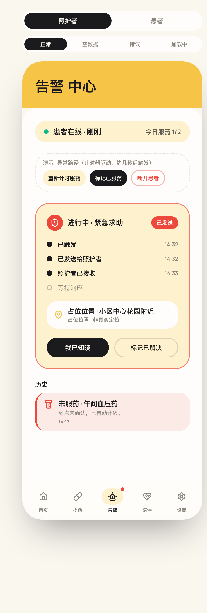

### 陪伴（聚合页）`/caregiver/care`
顶部 **远程呼叫患者** —— 以家人身份发起，患者大屏零操作自动接通；下方认人卡 / 声线 / **记忆库** / 对话记录入口。

### 记忆库 `/caregiver/memories`
**记忆投喂 → AI 用家人声线陪患者怀旧**（怀旧疗法）。按家人分组，每位家人「＋」投喂一段共同回忆：类型（儿时/日常/大事/地点）、标题、正文（文字），可选**录音音条**（本地不上传）。写回按家人归属的记忆库并持久化；患者与该家人 AI 声线对话时，`companionApi` 把回忆织入开场与后续（如「我刚想起小时候的事——你带我去河边捉萤火虫，你还记得吗？」）。
「基于记忆生成对话」抽象在可插拔的 `services/companionApi.ts`（`ingestMemory / generateReply`，现 mock），接入 Claude API / 本地模型时只替换该文件。

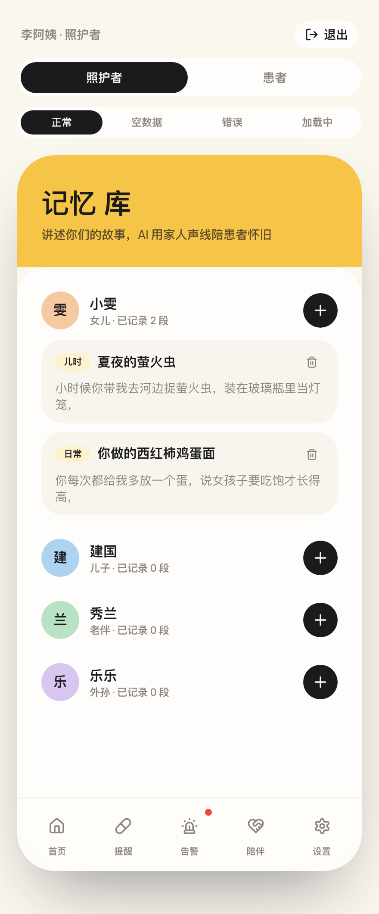
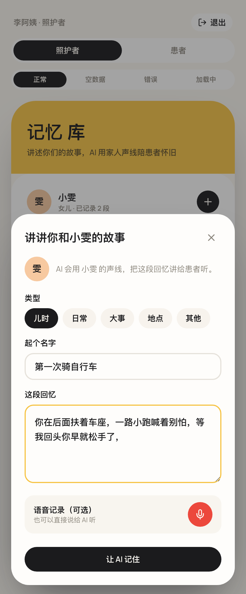

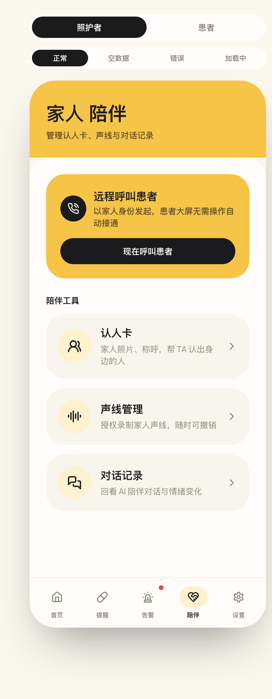

### 认人卡管理 `/caregiver/memory-cards`
家人头像网格 + 称呼；空态引导添加。
**新增/编辑/删除全功能**：右上「＋」或网格末尾「添加」卡新增，点卡片进入编辑；表单含**头像上传**（本地照片，或暖色底 + 姓名末字占位）、姓名、关系、称呼；写回可写家人 store 并**持久化到 localStorage**，患者「认认人」大屏读同一份数据。编辑态可删除（二次确认）。

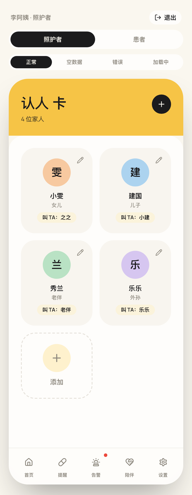
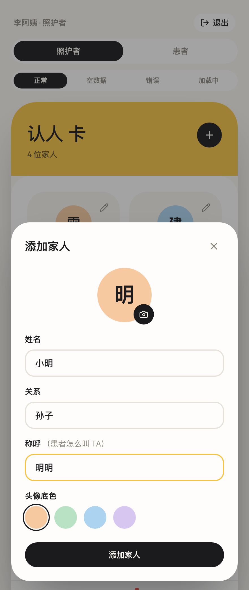

### 声线管理 `/caregiver/voices`
**授权录制全流程**：授权声明勾选 → **真实麦克风录音**（MediaRecorder + 实时波形/计时）→ 本地试听 → 训练进度轮询 → 就绪。撤销/重新授权（二次确认）；撤销后患者端该家人即时「暂不可对话」。录音**仅在本机处理、不上传**。
「训练+合成」抽象在可插拔的 `services/voiceApi.ts`（现为 mock 模拟进度）；接入 GPT-SoVITS / Replicate / HF 等真实后端时**只替换该文件**，接口 `enrollVoice / pollTraining / synthesize` 不变，上层无需改动。

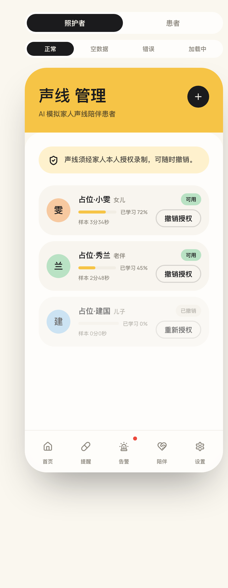
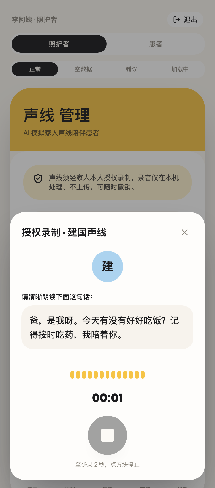

### 对话记录 `/caregiver/conversations`
**敏感话题置顶红标** + 情绪 chip + 摘要。

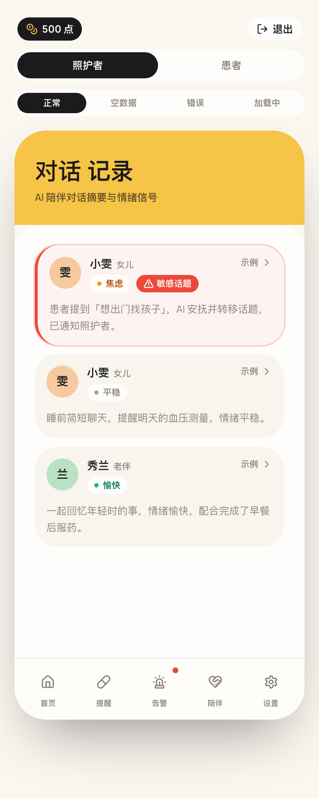

### 算力钱包 `/caregiver/wallet`
**按用量计费的算力充值/扣费**。透明计价：`token 现金成本 × 1.6（含 60% 利润）` 折算为「算力点」（当前每 1K tokens = ¥0.08 = 8 点；1 点 = ¥0.01）。
- 余额卡 + 顶栏余额胶囊；充值套餐（含赠送）+ 支付方式（**信用卡 / PayPal / 支付宝 / 微信支付**，mock 结账）+ 流水账。
- 扣费点：**训练声线**（约 320 点）、**投喂记忆**（随文本长度）、**AI 陪聊**（按会话）。
- 训练/投喂在余额不足时**拦截并引导充值**；患者对话为「尽力扣费、绝不硬阻断」（患者关怀优先）。
- 支付与计价抽象在可插拔的 `services/billingApi.ts`（`createRecharge / confirmPayment`），接 Stripe/PayPal/支付宝/微信只替换该文件；真实支付需后端+商户号，不在静态部署范围。

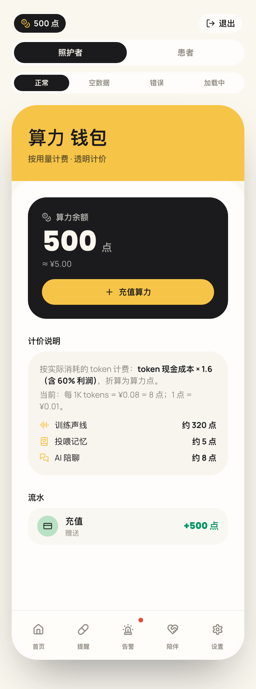
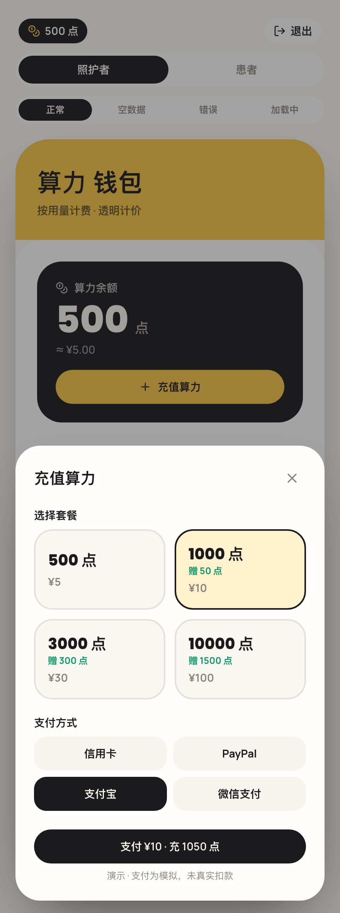

### 设置 `/caregiver/settings`
患者档案 / 主照护者 / 安全区占位（真实定位不在 POC 范围）+ AI 声线授权入口。

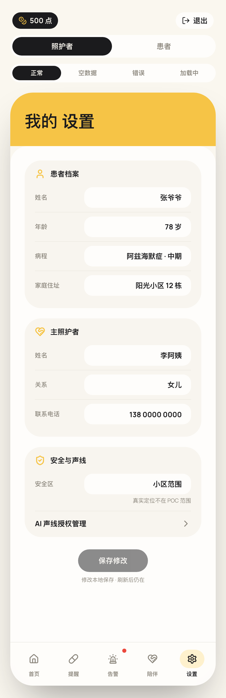

---

## 二、患者「老人屏」（横屏大屏 · 零操作被动接收）

固定摆放的大屏；核心是被动接听，主动拨出/认人保留。待机页右下"演示 · 被动事件"可逐个触发。

### 待机主页 `/patient`
左：大字问候 + 巨型时钟 + 今日提醒 + 巨大 SOS；右：家人头像可主动拨出（不可对话置灰）+ 认认人 + 演示触发。

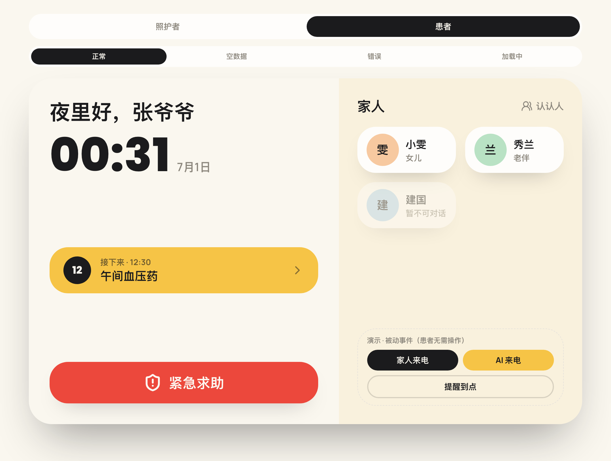

### 来电覆盖层（被动接听）`/patient?call=family`
"家人来电 / AI 模拟来电" + 大头像 +「无需操作，N 秒后自动接通」，倒计时结束**自动接通**。

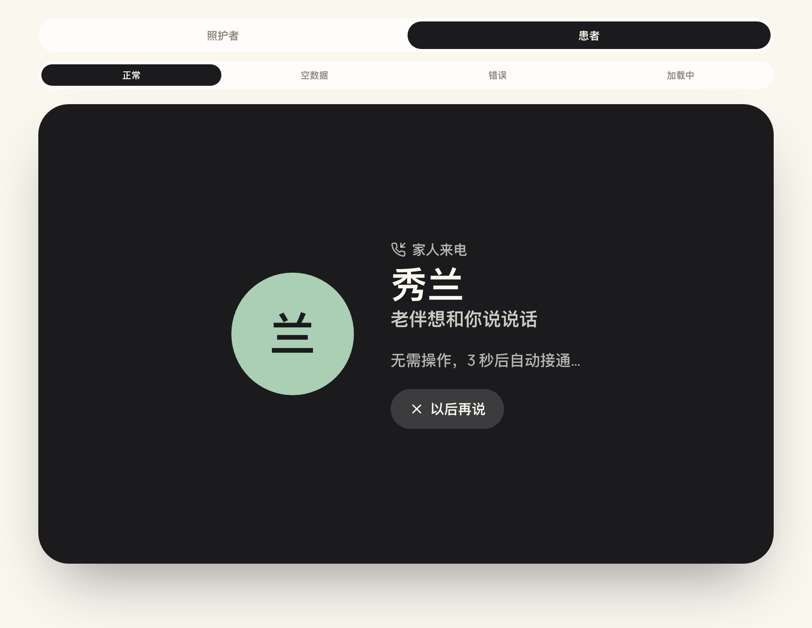

### 通话页 — AI 仿真 `/patient/talk/v1?by=ai`
显示「AI 模拟声音」明示 + 环境「正在聆听…」（设备自动收音，无按键）+ 大字幕 + 挂断。

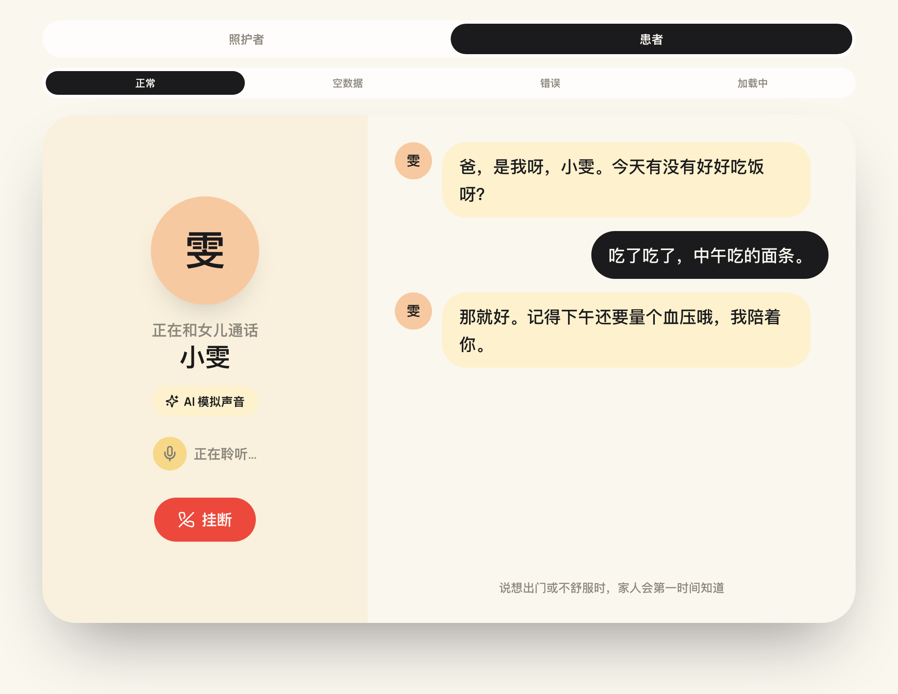

### 通话页 — 真人家人 `/patient/talk/v2?by=family`
照护者远程发起的真人来电，**不显示** AI 标签，来电人/对话与发起方一致。

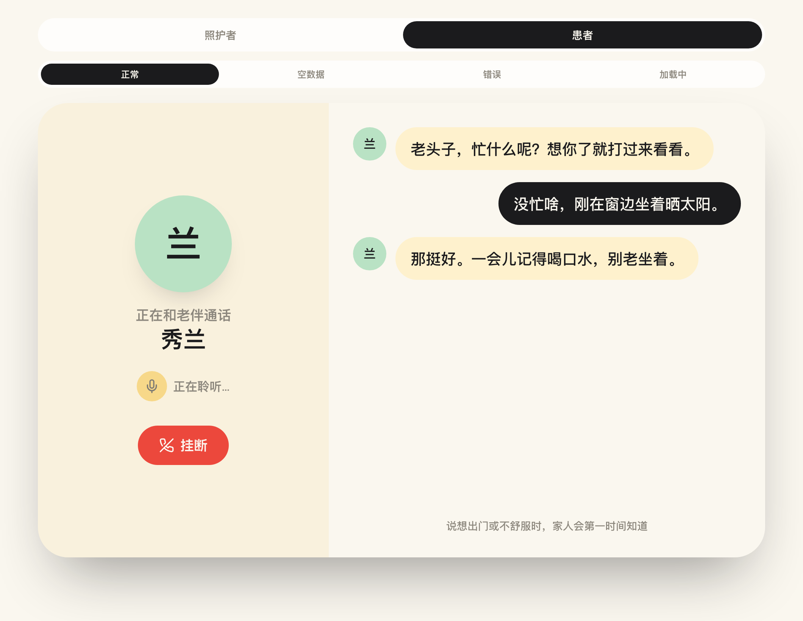

### 到点提醒覆盖层 `/patient?remind=1`
全屏大字「该吃药啦」+ 女儿声线提示 +「已完成 / 稍后提醒」；未操作将再次提醒并通知家人。

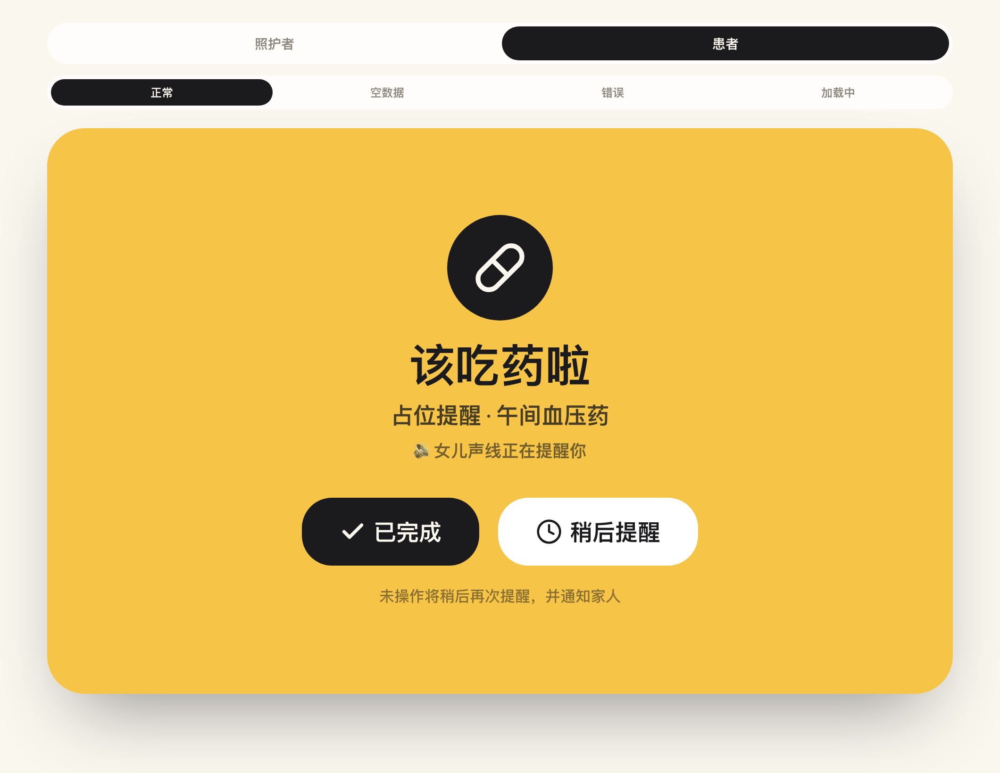

### 认人卡 `/patient/who`
大头像逐位浏览「这是你的女儿」+ 直达通话。

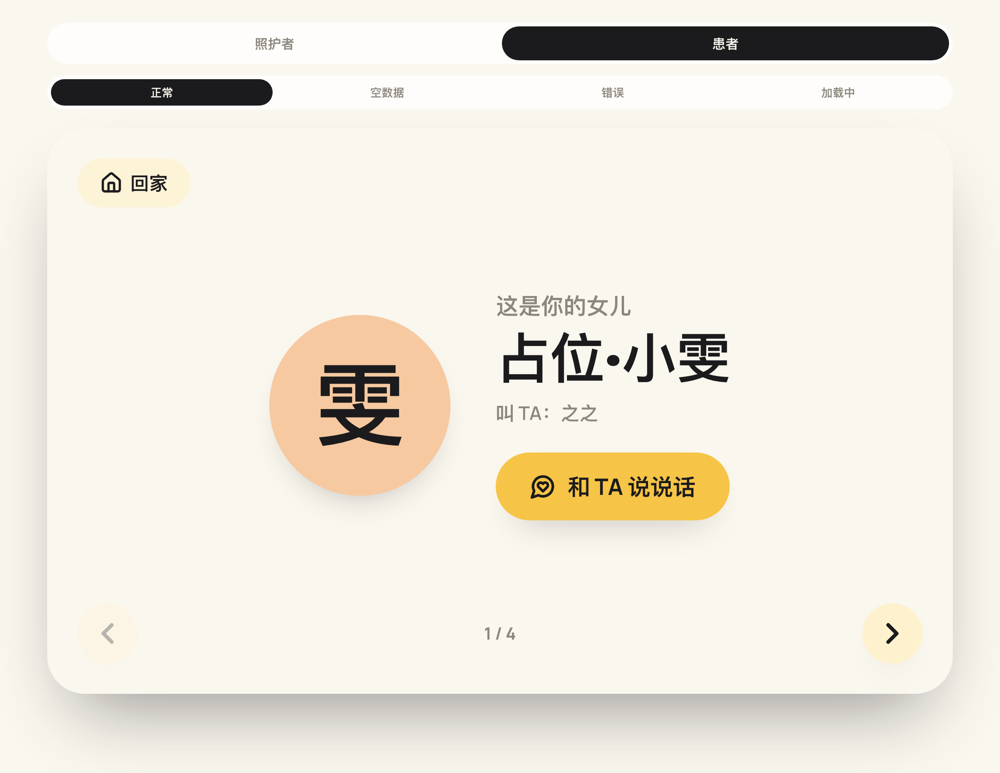

---

## 三、演示直达 URL

| 场景 | URL |
|---|---|
| 照护者首页 | `/caregiver` |
| 提醒 / 告警 / 陪伴 / 认人卡 / 声线 / 对话 / 设置 | `/caregiver/{reminders,alerts,care,memory-cards,voices,conversations,settings}` |
| 患者待机 | `/patient` |
| 患者·家人来电（被动） | `/patient?call=family` |
| 患者·AI 来电（被动） | `/patient?call=ai` |
| 患者·到点提醒 | `/patient?remind=1` |
| 患者·AI 通话 | `/patient/talk/v1?by=ai` |
| 患者·真人家人通话 | `/patient/talk/v2?by=family` |
| 患者·认人卡 | `/patient/who` |

> 四态：任意页配合顶部演示开关 `正常/空数据/错误/加载中` 查看。

---

## 四、端到端走查（对外演示脚本）

完整验收步骤见 [`../SPEC.md`](../SPEC.md) §11。对外演示推荐主线：

1. **远程呼叫 → 被动接听**：照护者「陪伴 → 现在呼叫患者」→ 自动切到患者大屏 → 倒计时自动接通 → 真人通话（无 AI 标签）。
2. **主动 + AI 明示 + 敏感**：患者待机点「小雯」拨出 → AI 通话（显示「AI 模拟声音」）→ 对话含敏感话题被安抚并同步到照护者「对话记录」置顶。
3. **到点提醒**：患者大屏「提醒到点」→「该吃药啦」→ 已完成。
4. **SOS 全链路**：患者按「紧急求助」→ 倒计时可撤销 → 照护者告警中心时间线流转。
5. **声线授权/撤销、失联、未服药升级**：见 SPEC §11。
